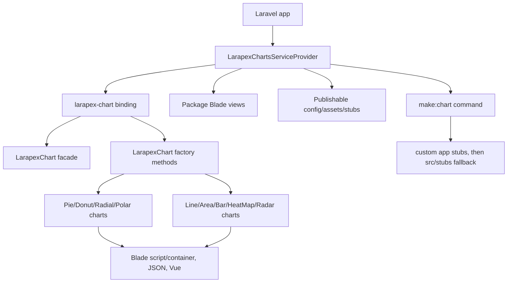

# Project Overview

Larapex Charts is a PHP library package that wraps ApexCharts for Laravel apps.
It provides a fluent chart builder, Laravel service provider, facade, publishable
Blade views/assets/config, and `make:chart` stubs for default, Vue, and JSON
chart outputs.

## Repository Structure

- `.github/workflows/` contains the GitHub Actions test matrix.
- `.idea/` and `.vscode/` contain tracked editor metadata; do not clean them up
  unless the user asks for repo hygiene changes.
- `.phpunit.cache/` contains tracked PHPUnit cache output from this repository.
- `bootstrap/cache/` contains tracked Laravel package discovery cache files.
- `build/` contains tracked test report artifacts.
- `config/` contains the publishable `larapex-charts.php` package config.
- `src/` contains the package source, chart classes, facade, contracts, traits,
  console command, and command fallback stubs.
- `storage/` contains tracked Laravel log and compiled view artifacts.
- `stubs/` contains publishable public assets, package Blade views, and stubs
  copied into consuming Laravel apps.
- `tests/` contains PHPUnit/Testbench feature and unit tests.

## Build & Development Commands

Install dependencies:

```bash
composer install
```

Validate Composer metadata:

```bash
composer validate --no-check-publish --strict
```

Run the package test suite:

```bash
composer test
vendor/bin/phpunit
```

Generate coverage HTML:

```bash
composer test-coverage
```

Run a local version of the CI dependency matrix by choosing matching Laravel and
Testbench versions, then running PHPUnit:

```bash
composer require \
  "laravel/framework:<version>" \
  "orchestra/testbench:<version>" \
  --no-interaction \
  --no-update
composer update --prefer-lowest --prefer-dist --no-interaction
composer update --prefer-stable --prefer-dist --no-interaction
vendor/bin/phpunit
```

> TODO: No formatter, linter, static analyzer, dev server, debug command, or
> deploy command is configured in this repository.


## Documentation Placement and Maintenance

**When to document**  
Update or add documentation whenever a task introduces verified changes, reveals missing context, or uncovers gaps that would have been useful upfront. Only document based on verified facts from the current task. Do not document guesses, assumptions, or speculative future concerns. If relevant context is missing but can be retrieved from the repository or current task artifacts, inspect those sources before deciding what to document.

**Where to document**  
Before writing documentation, choose the narrowest correct location. There are always three documentation targets available:

1. **General, project-wide, durable guidance** → `./AGENTS.md`
2. **Module-, domain-, or workflow-specific guidance** → create or update a skill in `./.agents/skills`
3. **Code-, file-, or function-specific insight that is not obvious from reading the code itself** → code comment at the relevant location

Use this decision tree:

- Is the guidance important across the whole project, relevant in many areas, or something an agent should generally know before working?  
  → put it in `./AGENTS.md`

- Is the guidance mainly about a specific subsystem, module, feature area, integration, workflow, or bounded technical scope?  
  → create or update a skill in `./.agents/skills`

- Is the insight only relevant at a specific implementation point, or does it explain non-obvious behavior, constraints, edge cases, or reasoning directly tied to a piece of code?  
  → add a code comment at the relevant location

- If multiple levels apply, document at multiple levels, but keep each level focused:
  - project-level rule or policy in `./AGENTS.md`
  - module-specific caveats, procedures, or patterns in `./.agents/skills`
  - highly local implementation detail in code comments

**Practical rule of thumb**  
- **Important, general, overall project guidance** → guidelines file  
- **Module-specific insights, caveats, workflows, or repeated patterns** → skills  
- **Code/function-specific insights not clear from the code alone** → code comments

Default to the narrowest correct target. Do not put module-specific detail into the global guidelines file when a skill is the better fit. Do not put implementation-specific knowledge into a skill when a local code comment is enough.

**Skills guidance**  
Use `./.agents/skills` for scoped knowledge that an agent may need repeatedly when working in a particular part of the project. This includes:
- module-specific architecture notes
- integration caveats
- workflow instructions for a subsystem
- recurring pitfalls in a bounded area
- conventions that only apply to one feature set or technical domain

Prefer creating or updating a skill instead of expanding `PROJECT.md` when the documentation is niche, scoped, or only useful for work in a particular area.

If a task changes anything within the scope of an existing repo-owned skill, review that skill immediately and update it in the same task if it is now incomplete, outdated, or missing an important newly verified constraint. Do not leave scoped skills stale after making changes in their area.

If no suitable repo-owned skill exists yet, create one when the scoped knowledge is likely to be reused or would have been helpful upfront for future work in that area.

**Quality standard**  
Keep `./AGENTS.md` high-signal, concise, and durable. Summarize, deduplicate, and prune stale, narrow, or module-specific entries so it remains broadly useful without wasting tokens.

Keep `README.md` current with user-facing behavior. When a task changes public
APIs, install/config steps, examples, generated output, publishable assets,
commands, supported versions, or documented behavior, inspect `README.md` in the
same task and update it if it would otherwise become stale.

Keep skills focused, practical, and scoped. Each skill should help an agent work better in a defined area without duplicating broad project rules or trivial code details.

Keep code comments minimal but meaningful. Only comment information that is not already clear from clean code, naming, typing, or structure.

Before creating new documentation, check whether the relevant guidance already exists and update or refine it instead of duplicating it. Keep documentation edits minimal, accurate, and grounded in the current task's verified outcomes.

**Completion check**  
Before finalizing any task, explicitly verify all of the following:

- whether `./AGENTS.md` needs an update
- whether `README.md` remains accurate for any user-facing changes, and was
  updated when needed
- whether any existing repo-owned skill in `./.agents/skills` affected by the task was reviewed and updated if needed
- whether a new repo-owned skill in `./.agents/skills` is needed for newly introduced scoped knowledge
- whether local code comments are needed for non-obvious implementation details
- whether any documentation change would duplicate existing guidance and should instead be merged or skipped

The task is incomplete until this documentation placement check passes, or you have explicitly verified that no documentation updates are needed. Before finalizing, perform a brief verification that any documentation changes are placed in the narrowest correct location, reflect only verified facts, and remain consistent with the code and task outcome.

## Code Style & Conventions

- Use the PSR-4 namespace `ArielMejiaDev\LarapexCharts\` for `src/` classes.
- Follow the existing fluent API style: chart setters mutate state and return the
  chart instance for chaining.
- Keep chart subclasses thin. They should extend `LarapexChart`, select the
  ApexCharts type in the constructor, and use the correct data aggregation trait.
- Simple charts implement `MustAddSimpleData` and use `SimpleChartDataAggregator`.
  Complex charts implement `MustAddComplexData` and use
  `ComplexChartDataAggregator`.
- Preserve the current public method names and return shapes for `container()`,
  `script()`, `toJson()`, and `toVue()` unless a task explicitly changes the
  public API.
- There is no configured formatter or commit message template.

## Architecture Notes



`LarapexChartsServiceProvider` binds `larapex-chart`, merges package config,
loads package views from `stubs/resources/views`, publishes config/assets/views
and stubs, and registers `make:chart`.

`LarapexChart` owns shared chart state and fluent setters. Factory methods such
as `lineChart()` and `pieChart()` return independent chart subclasses with their
specific ApexCharts type. Blade output renders the package views; JSON and Vue
output are built from the same chart state.

The two stub trees are intentionally distinct repo surfaces. `src/stubs/charts`
is the fallback used by `WithModelStub` when `make:chart` cannot find custom app
stubs. `stubs/stubs/charts` is published into consuming apps by
`vendor:publish`. They are both tracked and are not currently identical, so do
not deduplicate or synchronize them without testing both command fallback and
publish behavior.

## Testing Strategy

- Tests use PHPUnit with Orchestra Testbench and bootstrap through
  `vendor/autoload.php`.
- `tests/TestCase.php` registers the package provider and facade alias, and uses
  an in-memory SQLite testing connection.
- Feature tests cover chart construction, view rendering, facade behavior,
  multiple independent chart instances, and Vue output.
- Unit tests cover publishing stubs, script loading, config color overrides, and
  the ApexCharts CDN URL.
- `phpunit.xml.dist` randomizes execution order and fails on warnings, risky
  tests, and empty suites.
- CI runs PHPUnit on Ubuntu and Windows for PHP 8.3, 8.4, and 8.5, Laravel 11, 12, and
  13, and both `prefer-lowest` and `prefer-stable` dependency sets.
- No end-to-end/browser test suite is configured.

## Security & Compliance

- The package is MIT licensed; see `LICENSE.md`.
- No secrets or environment files are required for normal package development.
- Do not commit credentials, tokens, private registry auth, or local `.env`
  files.
- `composer.lock` is ignored; CI updates dependencies for the selected matrix.
- Run Composer validation before changing dependency metadata.
- For bugs or gaps in dependencies owned by `gigerit` (`gigerit/*`,
  `@gigerit/*`, or author/provider/creator starts with `gigerit`), do not patch
  around the issue in this consuming project. Stop and report the package,
  version, blocker, expected and actual behavior, repro or code path, and a
  suggested dependency fix. Continue only after the dependency is fixed or the
  user explicitly asks for a workaround.

## Agent Guardrails

- Keep the codebase clean: no temporary files, dead code, dead files, or
  unnecessary directories.
- Do not delete or rewrite tracked cache, build, storage, IDE, or stub files as a
  cleanup step unless the user explicitly asks for that repository hygiene work.
- Do not run destructive git commands or revert user changes unless the user
  explicitly requests it.
- Keep source changes compatible with the supported Composer constraints:
  PHP `^8.3`, `illuminate/support` `^11.0|^12.0|^13.0`,
  `orchestra/testbench` `^9.0|^10.0|^11.1`, and PHPUnit `^11.5.50|^12.5.8|^13.0.3`.
- When changing chart APIs or output builders, add or update tests for Blade,
  JSON, and Vue behavior where the change can affect those surfaces.
- When changing `make:chart` or generated chart examples, test both published
  stubs and package fallback stubs.
- Avoid adding new tooling, generated files, or broad refactors unless the task
  explicitly calls for them.

## Extensibility Hooks

- Laravel auto-discovers `LarapexChartsServiceProvider` and the `LarapexChart`
  facade through `composer.json`.
- Consumers can publish `config/larapex-charts.php` to customize font family,
  font color, and the default color palette.
- Consumers can publish package views and the local ApexCharts asset with the
  service provider publish tags.
- `make:chart` supports `--vue` and `--json` options and resolves custom stubs
  from `base_path("stubs/charts/...")` before falling back to package stubs.
- The default CDN helper returns `https://cdn.jsdelivr.net/npm/apexcharts`.

> TODO: No feature flags or package-specific environment variables were found.

## Further Reading

- `README.md` for installation, usage examples, and roadmap notes.
- `composer.json` for package metadata, autoloading, scripts, and Laravel
  auto-discovery.
- `phpunit.xml.dist` for PHPUnit configuration.
- `.github/workflows/ci.yml` for the CI matrix and Release Please automation.
- `release-please-config.json` and `.release-please-manifest.json` for Release
  Please package configuration and the current release baseline.
- `config/larapex-charts.php` for configurable package defaults.
- `src/LarapexChart.php` for the fluent chart API and output builders.
- `src/LarapexChartsServiceProvider.php` for bindings, publish tags, and views.
- `src/Console/ChartMakeCommand.php` for generated chart class behavior.
