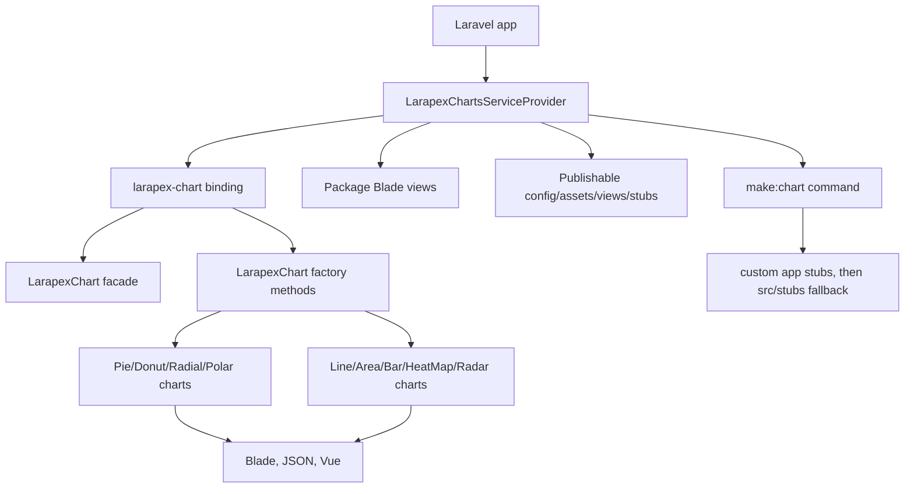

# Project Overview

Larapex Charts is a PHP library for Laravel apps. It wraps ApexCharts with a
fluent chart builder, service provider, facade, publishable config/views/assets,
and `make:chart` stubs for Blade, JSON, and Vue output.

## Repository Structure

- `.github/workflows/` GitHub Actions CI and Release Please workflow.
- `.idea/`, `.vscode/` tracked editor metadata; do not clean up casually.
- `.phpunit.cache/`, `bootstrap/cache/`, `build/`, `storage/` tracked generated
  or test artifacts; leave intact unless asked for repo hygiene.
- `config/` publishable `larapex-charts.php` config.
- `resources/boost/` Laravel Boost package resources, including package skill.
- `src/` package source, chart classes, facade, contracts, traits, command, and
  command fallback stubs.
- `stubs/` publishable public asset, Blade views, command stubs, and app stubs.
- `tests/` PHPUnit/Testbench feature and unit tests.

## Build & Development Commands

Install dependencies:

```bash
composer install
```

Validate Composer metadata:

```bash
composer validate --no-check-publish --strict
```

Run tests:

```bash
composer test
vendor/bin/phpunit
```

Run PHPStan static analysis at level 1:

```bash
composer test:types
vendor/bin/phpstan analyse --memory-limit=1G
```

Generate HTML coverage:

```bash
composer test-coverage
```

Run a local CI-matrix slice:

```bash
composer require \
  "laravel/framework:<version>" \
  "orchestra/testbench:<version>" \
  --no-interaction \
  --no-update
composer update --prefer-lowest --prefer-dist --no-interaction
composer update --prefer-stable --prefer-dist --no-interaction
vendor/bin/phpunit
```

> TODO: No formatter, linter, dev server, debug command, or deploy command is
> configured.

## Code Style & Conventions

- PHP namespace stays `ArielMejiaDev\LarapexCharts\` for source and public API.
- Composer package is `gigerit/larapex-charts`; do not rename PHP imports to
  `Gigerit\...`.
- Fluent setters mutate chart state and return the chart instance.
- Chart subclasses stay thin: extend `LarapexChart`, set ApexCharts type in the
  constructor, and use the right data trait.
- Simple charts implement `MustAddSimpleData` and use
  `SimpleChartDataAggregator`.
- Complex charts implement `MustAddComplexData` and use
  `ComplexChartDataAggregator`.
- Preserve public names and return shapes for `container()`, `script()`,
  `toJson()`, and `toVue()` unless the task explicitly changes API behavior.
- No configured formatter or commit message template exists.

## Architecture Notes



`LarapexChartsServiceProvider` binds `larapex-chart`, merges config, loads views
from `stubs/resources/views`, publishes config/assets/views/stubs/commands, and
registers `make:chart`.

`LarapexChart` owns shared chart state, factory methods, and output builders.
Factories return independent subclasses for specific ApexCharts types. Blade,
JSON, and Vue output come from the same chart state.

Two stub trees are intentionally separate. `src/stubs/charts` is command
fallback for `WithModelStub`. `stubs/stubs/charts` is published into consuming
apps. They are tracked and not identical; do not deduplicate or sync them unless
testing both command fallback and publish behavior.

## Testing Strategy

- Tests use PHPUnit with Orchestra Testbench and `vendor/autoload.php`.
- PHPStan is configured at level 1 in `phpstan.neon.dist`; run it with
  `composer test:types`.
- `tests/TestCase.php` registers the provider and facade alias, using in-memory
  SQLite.
- Feature tests cover chart construction, view rendering, facade behavior,
  independent chart instances, and Vue output.
- Unit tests cover publishing stubs, script loading, config color overrides, and
  the ApexCharts CDN URL.
- `phpunit.xml.dist` randomizes order and fails on warnings, risky tests, and
  empty suites.
- CI runs PHPUnit on Ubuntu and Windows for PHP 8.3, 8.4, 8.5; Laravel 11, 12,
  13; and `prefer-lowest` plus `prefer-stable`.
- No end-to-end/browser suite is configured.

## Security & Compliance

- MIT license; see `LICENSE.md`.
- No secrets or `.env` files are required for normal package work.
- Do not commit credentials, tokens, private registry auth, or local `.env`.
- `composer.lock` is ignored; CI resolves dependencies for the selected matrix.
- Run Composer validation before dependency metadata changes.
- If blocked by a bug/gap in a dependency owned by `gigerit` (`gigerit/*`,
  `@gigerit/*`, or author/provider/creator starts with `gigerit`), do not patch
  around it here. Stop and report package, version, blocker, expected/actual,
  repro/code path, and suggested dependency fix. Continue only after dependency
  fix or explicit user workaround approval.

## Agent Guardrails

- Shared worktree: do not revert, clean, stage, move, delete, or reformat
  unrelated user/agent changes. If overlap exists, preserve other work and make
  the smallest compatible edit.
- Keep repo clean: no temporary files, dead code, dead files, or needless dirs.
- Do not run destructive git commands unless explicitly requested.
- Keep changes compatible with Composer constraints: PHP `^8.3`,
  `illuminate/support` `^11.0|^12.0|^13.0`, Testbench `^9.0|^10.0|^11.1`,
  PHPUnit `^11.5.50|^12.5.8|^13.0.3`, PHPStan `^2.1`.
- Chart API or output-builder changes need tests for affected Blade, JSON, and
  Vue surfaces.
- `make:chart` or generated-example changes need tests for published stubs and
  package fallback stubs.
- Do not add tooling, generated files, or broad refactors unless requested.
- Documentation placement: update `README.md` for user-facing behavior changes;
  use root `AGENTS.md` only for durable repo-wide guidance; use scoped skills
  for bounded subsystem knowledge; use code comments only for non-obvious local
  behavior.
- Before finalizing, verify `AGENTS.md`, `README.md`, repo-owned skills under
  `.agents/skills`, and code comments need no further update. Avoid duplicate
  docs; place new docs at the narrowest correct level.

## Extensibility Hooks

- Laravel auto-discovers provider and facade alias through `composer.json`.
- Laravel Boost can discover
  `resources/boost/skills/larapex-charts-development/SKILL.md` in consuming apps
  that install this package and `laravel/boost`.
- Consumers can publish config, views, local ApexCharts asset, commands, and
  stubs through service-provider publish tags.
- Config controls default font family, font color, and palette.
- `make:chart` supports `--vue` and `--json`; custom app stubs from
  `base_path("stubs/charts/...")` win before package fallback stubs.
- Default CDN helper returns `https://cdn.jsdelivr.net/npm/apexcharts`.

> TODO: No feature flags or package-specific environment variables were found.

## Further Reading

- `README.md` install, usage examples, and roadmap.
- `composer.json` metadata, autoloading, scripts, and Laravel auto-discovery.
- `phpstan.neon.dist` PHPStan level and analysis paths.
- `phpunit.xml.dist` PHPUnit configuration.
- `.github/workflows/ci.yml` CI matrix and Release Please workflow.
- `release-please-config.json` and `.release-please-manifest.json` release setup.
- `config/larapex-charts.php` configurable defaults.
- `src/LarapexChart.php` fluent chart API and output builders.
- `src/LarapexChartsServiceProvider.php` bindings, publish tags, and views.
- `src/Console/ChartMakeCommand.php` generated chart behavior.
